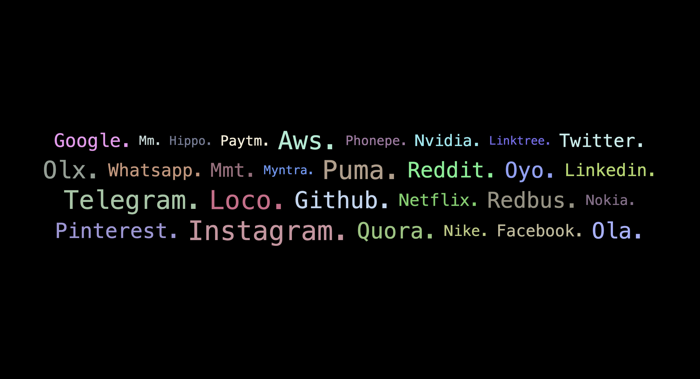
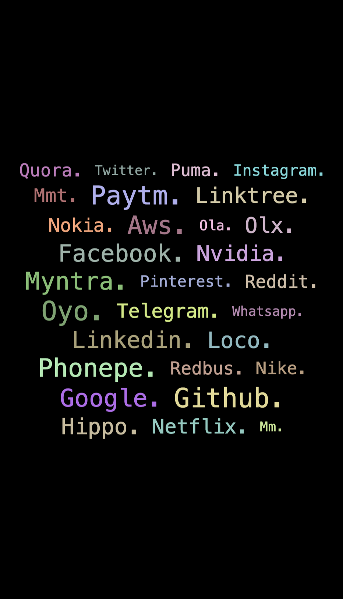

# Linkscape

This website serves as a simple platform to display profile links. Whether you want to share your social media profiles, professional networks, or any other online presence, this site provides a clean and minimalist way to showcase your links.

## Features

- **User-Friendly Interface:** The website offers an intuitive and user-friendly interface, making it easy for visitors to access and explore your profile links.

- **Responsive Design:** Whether viewed on a desktop, tablet, or mobile device, the website adapts seamlessly to provide an optimal viewing experience.

- **Customization:** Easily customize and update your profile links as needed. Add or remove links to suit your preferences.

## How to Use

- **Clone the Repository:** Start by cloning the repository using the following command in your terminal or command prompt:

    `git clone https://github.com/bhupenderhere/Linkscape.git`
    
- **Modify the Links Configuration:** Navigate to the cloned repository's directory and locate the links.json file. Modify this file according to your preferences, adding or updating the profile links as needed.

- **Run the Website Locally:** Open the index.html file in your web browser. You can do this by right-clicking on the file and selecting an option like "Open with" in your file explorer, or by using a command such as:

    `open index.html`

    Ensure that your browser allows local file access or use a simple web server to serve the files locally.

- **Explore Profile Links:** Scroll through the page to view the displayed profile links. Each link is clickable, directing visitors to your respective profiles.

- **Mobile Friendly:** Access the website on your mobile device for a mobile-optimized experience.

Now you have successfully cloned the repository, customized the profile links, and run the website locally.

## Example Image Previews
### Desktop Preview

### Mobile Preview

## Contributing
If you would like to contribute to the development of this website or report any issues, feel free to [create an issue](https://github.com/bhupenderhere/Linkscape/issues) or submit a pull request.

## License
This project is licensed under the MIT License - see the [LICENSE](LICENSE) file for details.
